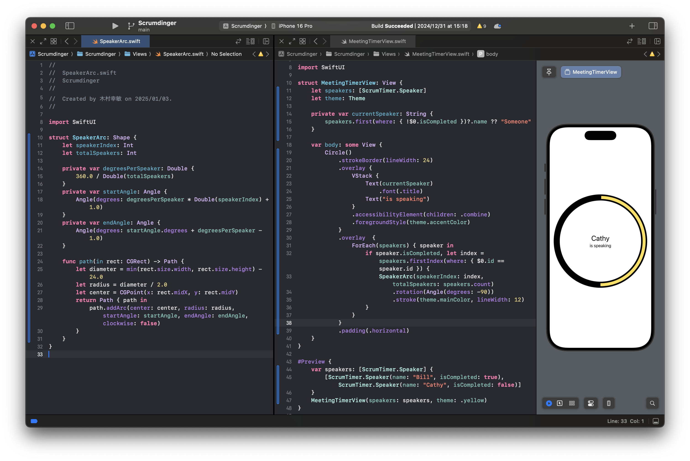

<!-- _class: title -->
---
<!-- _class: title -->
 iOS開発 2
<span style="font-size:160pt;">　</span>
 木村幸敏


---
目次


---
# SwiftUI essentials
## Using stacks to arrange views
https://developer.apple.com/tutorials/app-dev-training/using-stacks-to-arrange-views

In this section, you’ll build the header of the timer screen to display the elapsed time and remaining time of a meeting.
You’ll use the progress view to display the percentage of time elapsed during the scrum.


---
you’ll create a placeholder for the circular timer view that appears in the center of the screen.


---
# Views
## Creating a card view
https://developer.apple.com/tutorials/app-dev-training/creating-a-card-view

Create a color theme


---
Create a daily scrum model


---
Create the card view
CardView will summarize the DailyScrum model data and display the title, the number of participants, and the duration.
you’ll style the card to highlight the most important information, and you’ll modify the visual components to ensure adequate contrast between text and background views in light and dark appearances.
Next, you’ll create a label style to stack the scrum length and clock icon horizontally. With the LabelStyle protocol, you can create a consistent design throughout your app by reusing the same label style for several views.


---
## Displaying data in a list
https://developer.apple.com/tutorials/app-dev-training/displaying-data-in-a-list
you’ll dynamically generate rows from an array of DailyScrum objects


---
Open DailyScrum.swift, and declare conformance to the Identifiable protocol.


---
Open ScrumdingerApp.swift, and set ScrumsView as the initial view for the app.

```
@main
struct ScrumdingerApp: App {
    var body: some Scene {
        WindowGroup {
            ScrumsView(scrums: DailyScrum.sampleData)
        }
    }
}
```


---
# Navigation and modal presentation
## Creating a navigation hierarchy
https://developer.apple.com/tutorials/app-dev-training/creating-a-navigation-hierarchy

Set up navigation
In ScrumsView.swift, embed the List in a NavigationStack.
Add a NavigationLink, passing Text(scrum.title) as the destination in the initializer.
Add a toolbar, and add a Button toolbar item that displays the plus icon. Pass an empty action to the button for now.


---
Create the detail view


---
Iterate through attendees
In DailyScrum.swift, create an extension with an inner structure named Attendee that is identifiable.
In DetailView.swift, create a Section with a header of "Attendees" to group the attendee information.


---
Navigate between screens
Wrap the Start Meeting Label with a NavigationLink that sets MeetingView as the destination.


---
## Managing data flow between views
https://developer.apple.com/tutorials/app-dev-training/managing-data-flow-between-views


---
## Creating the edit view
https://developer.apple.com/tutorials/app-dev-training/creating-the-edit-view

Add a @State property named scrum that represents the scrum you’re editing. Initialize the new property with an empty scrum.


---
Display attendees in the edit view


---
Present the edit view
When isPresentingEditView changes to true, the app presents DetailEditView using a modal sheet that partially covers the underlying content.


---
# Passing data
## Passing data with bindings
https://developer.apple.com/tutorials/app-dev-training/passing-data-with-bindings

Add a theme view


---
Add a theme picker


---
Pass the edit view a binding to data
In DetailEditView.swift, add a theme picker, and pass it a binding to a theme.


---
Pass a binding into the detail view
In ScrumsView.swift, convert the scrums constant to a binding.

Pass a binding into the list view
In ScrumdingerApp.swift, add a private @State property named scrums.


---
# State management
https://developer.apple.com/tutorials/app-dev-training/making-classes-observable
https://developer.apple.com/tutorials/app-dev-training/responding-to-events
## Managing state and life cycle
https://developer.apple.com/tutorials/app-dev-training/managing-state-and-life-cycle
Create an overlay view
Start by adding some visual polish to the meeting timer screen.


---
Extract the meeting header
In this section, you’ll extract the meeting header into its own view, create properties to pass a meeting’s elapsed and remaining time, and update the logic of the progress view and accessibility labels.


---
Add a state object for a source of truth
Add a call to the meeting header subview that uses scrumTimer to provide the secondsElapsed and secondsRemaining arguments.


---
Add life cycle events
Add an onAppear modifier, and call scrumTimer.reset, passing in the length in minutes and attendees.
Add an onDisappear modifier, and call scrumTimer.stopScrum().


---
Extract the meeting footer
Create a new SwiftUI View file named MeetingFooterView.swift, and extract the HStack from MeetingView.swift to the MeetingFooterView body.
In MeetingView.swift, add a call to the MeetingFooterView, passing speakers and the skip action.


---
Trigger sound with AVFoundation


---
## Updating app data
https://developer.apple.com/tutorials/app-dev-training/updating-app-data

Use the edit view to create a new scrum


---
Add scrum history
In MeetingView.swift, create a History, and insert it into scrum.history.


---
# Persistence and concurrency
## Persisting data
https://developer.apple.com/tutorials/app-dev-training/persisting-data

Add codable conformance
Codable is a type alias that combines the Encodable and Decodable protocols. When you implement these protocols on your types, you can use the Codable API to easily serialize data to and from JSON.


---
Create a data store
An ObservableObject includes an objectWillChange publisher that emits when one of its @Published properties is about to change. Any view observing an instance of ScrumStore will render again when the scrums value changes.
Add a method to load data
In this section, you’ll add a method to read JSON data from the scrums.data file and decode the data to an array of daily scrums.
Add a method to save data


---
Load data on app launch
Use a do-catch statement to load the saved scrum or halt execution if load() throws an error.


---
Save data in inactive state
Call saveAction() if the scene is moving to the inactive phase.
In ScrumdingerApp.swift, add a trailing closure to the ScrumsView initializer, and create an empty Task inside.


---
## Adopting new API features
https://developer.apple.com/tutorials/app-dev-training/adopting-new-api-features
## Handling errors
https://developer.apple.com/tutorials/app-dev-training/handling-errors

Add an error wrapper structure
Create an error view


---
Report errors
In ScrumdingerApp.swift, add an optional state variable named errorWrapper.


---
Simulate data corruption
`xcrun simctl get_app_container booted name.yukitoshi.Scrumdinger data`


---
# Drawing
## Drawing the timer view
https://developer.apple.com/tutorials/app-dev-training/drawing-the-timer-view

Create the meeting timer view
you’ll create MeetingTimerView, which builds upon the circle to present a visualization of meeting progress and the current speaker’s name.


---
Draw an arc segment
In this section, you’ll create a single arc segment that traces a portion of a circle, representing one speaker’s time.
Draw the progress ring
The stroke modifier traces a line along the path of the shape.




---
# Recording audio
## Examining data flow in Scrumdinger
https://developer.apple.com/tutorials/app-dev-training/examining-data-flow-in-scrumdinger
## Transcribing speech to text
https://developer.apple.com/tutorials/app-dev-training/transcribing-speech-to-text


---
Integrate speech recognition


---
Display recording indicators


---
Create a history view


---
Display a history view


---
---
# UIKit essentials
## Getting started with Today
https://developer.apple.com/tutorials/app-dev-training/getting-started-with-today
## Creating a list view
https://developer.apple.com/tutorials/app-dev-training/creating-a-list-view


---
